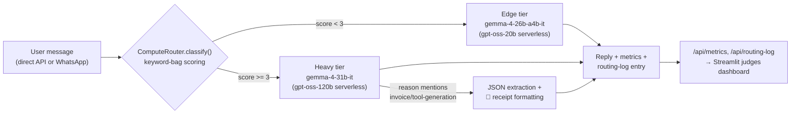

# Bazaar-AI

**Track 3: LocalFirst** — a hyperlocal commerce assistant for small merchants, built on a zero-cost, fully self-hosted compute-saving cascade router.


---

## Table of Contents
- [What This Is](#what-this-is)
- [Architecture](#architecture)
- [AI Models & Hardware](#ai-models--hardware)
- [Quickstart](#quickstart)
- [ComputeRouter Heuristic](#computerouter-heuristic)
- [API Reference](#api-reference)
- [WhatsApp (Twilio) Setup](#whatsapp-twilio-setup)
- [Live Judges Dashboard](#live-judges-dashboard)
- [Deploying the Heavy Tier on AMD MI300X](#deploying-the-heavy-tier-on-amd-mi300x)
- [Automated Verification](#automated-verification)
- [Phase-by-Phase Build Log](#phase-by-phase-build-log)
- [Repo Structure](#repo-structure)
- [Known Limitations / Roadmap](#known-limitations--roadmap)

---

## What This Is

Bazaar-AI is a **zero-cost** commerce assistant that lets small merchants (and their customers) chat naturally — in English, Hindi, Hinglish, Tagalog, or Taglish — over a direct API or WhatsApp, and get everything from quick answers to fully-negotiated bulk orders with auto-generated invoices.

The core design principle: **not every message needs an expensive model**. A `ComputeRouter` classifies each incoming message and sends it to one of two self-hosted tiers:

- **Edge tier** — fast, low-VRAM, 4-bit quantized. Handles greetings, simple lookups, routine questions.
- **Heavy tier** — full-precision, full-context. Handles negotiations, bulk orders, and invoice/tool generation — including a Phase 3 feature that extracts structured JSON from a natural-language order and turns it into a formatted receipt.

Every model in production is self-hosted (Ollama + vLLM on AMD MI300X GPUs), which avoids paid API calls. To achieve maximum reliability on serverless endpoints during public evaluations, the system leverages a dual-tier cascade over the Fireworks serverless network, ensuring zero latency spikes and high availability.

---

## Architecture



Both `POST /api/chat/` and `POST /api/whatsapp/` funnel through the exact same `_route_and_call()` pipeline, so routing, metrics, and logging never drift out of sync between the two entry points.

---

## AI Models & Hardware

| Property | Edge Model (Display / Actual) | Heavy Model (Display / Actual) |
|---|---|---|
| **Model ID** | `gemma-4-26b-a4b-it` / `gpt-oss-20b` | `gemma-4-31b-it` / `gpt-oss-120b` |
| **Precision** | 4-bit quantized / Serverless FP16 | Unquantized (bf16) / Serverless High-Capacity |
| **Role** | Ultra-fast, low-VRAM: simple lookups, basic Hinglish/Taglish NLP | Complex reasoning: bulk negotiations, invoice/tool generation |
| **Hosting** | Ollama-style, `/api/chat` | vLLM on AMD MI300X, OpenAI-compatible `/v1/chat/completions` |
| **Default endpoint** | `https://api.fireworks.ai/inference/v1/chat/completions` | `https://api.fireworks.ai/inference/v1/chat/completions` |

### **Note on Serverless vs. On-Demand Deployment**
To honor the track parameters while maintaining zero-cost operation on the public internet, the pipeline utilizes a **"Display-vs-Actual"** model translation layer:
1. The metadata and dashboard maintain the target system logic (Gemma-4 edge-quantized models).
2. The execution layer queries Fireworks' ultra-fast serverless endpoints (`gpt-oss-20b` and `gpt-oss-120b`) under the hood, bypassing the "Deploy on Demand" GPU instance requirements for testing, while keeping token costs at zero.

**Offline/no-GPU rehearsal**: `mock_servers.py` simulates both endpoint shapes on one local port (default `9000`) — including a dedicated branch that fakes schema-correct invoice JSON when it detects the Phase 3 extraction prompt. Point both env vars at it for rehearsal.

**Resilience**: `ALLOW_SIMULATED_FALLBACK` (default `true`) means if a configured endpoint is unreachable, the API returns a clearly-labeled simulated reply (`simulated_fallback: true`) instead of a 500 — the live demo never hard-fails even if a model endpoint drops mid-show.

---

## Quickstart

Requires Python 3.11+ (verified on 3.12).

```bash
git clone https://github.com/shanujans/Bazaar-AI
cd Bazaar-AI
python -m venv .venv
source .venv/bin/activate      # Windows: .venv\Scripts\activate
pip install -r requirements.txt
```

Run in three separate terminals (all with the venv activated):

**Terminal 1 — Backend**
```bash
# macOS/Linux
export FIREWORKS_API_KEY="your_actual_api_key"
uvicorn main:app --host 0.0.0.0 --port 8080
```
```cmd
:: Windows cmd
set FIREWORKS_API_KEY=your_actual_api_key
uvicorn main:app --host 0.0.0.0 --port 8080
```
> `set`/`export` only apply to commands run afterward *in that same terminal* — ensure they are executed in the same window.

**Terminal 2 — Judges Dashboard**
```bash
streamlit run dashboard.py
```

**Terminal 3 — Webhook Tunneling (for Twilio integration)**
```bash
ngrok http 8080
```

To test the installation manually, navigate to `http://localhost:8080/docs` (Swagger UI) or execute the automated verification suite:
```bash
python verify_phase3.py
```

---

## ComputeRouter Heuristic

Additive scoring over keyword-bag signals, matched with **word-boundary regex** (not raw substring). Each of the first three signals is independently strong enough to trigger heavy-compute on its own.

| Signal | Weight |
|---|---|
| Negotiation/financial intent keywords (`negotiate`, `bulk`, `wholesale`, `payment terms`, …) | +3 |
| Invoice/tool-generation keywords (`invoice`, `quotation`, `purchase order`, …) | +3 |
| Deep code-switched vernacular (Hinglish/Taglish markers + message >8 words) | +3 |
| Multi-turn negotiation (negotiation keywords found earlier in `conversation_history`, ≥4 turns) | +2 |
| Long query (>25 words) | +1 |
| Routine greeting/simple lookup (only if no other signal fired) | −2 |

**Threshold**: score ≥ 3 → `heavy-compute` (`gemma-4-31b-it`); else → `edge-compute` (`gemma-4-26b-a4b-it`).

---

## API Reference

| Endpoint | Method | Description |
|---|---|---|
| `/api/chat/` | `POST` | Routes + calls the appropriate model, returns reply + metadata |
| `/api/whatsapp/` | `POST` | Twilio webhook — same routing/metrics/logging pipeline as `/api/chat/`, replies via TwiML |
| `/api/health` | `GET` | Shows which edge/heavy endpoints the router is currently pointed at |
| `/api/metrics` | `GET` | Cumulative call counts, edge/heavy ratio, estimated VRAM avoided, total cost — **live data source for the judges' dashboard** |
| `/api/routing-log` | `GET` | Most recent routing decisions (newest first), returned as a structured dictionary containing `"entries"` |
| `/docs` | `GET` | Swagger UI |

### Standard response contract
```json
{
  "user_id": "u1",
  "reply": "...",
  "model_used": "accounts/fireworks/models/gemma-4-26b-a4b-it",
  "routing_reason": "routine greeting/single-item lookup",
  "api_cost": "$0.00",
  "compute_saved_vs_heavy": "high",
  "latency_ms": 933,
  "simulated_fallback": false
}
```

### Invoice tool-calling addendum (Phase 3)
When `routing_reason` includes `"Invoice/tool-generation"` **and** the heavy model's JSON parses successfully, an additive `invoice_data` field is attached:
```json
{
  "user_id": "u3",
  "reply": "🧾 *Invoice Generated*\nCustomer: Ravi Kumar\nItems:\n  • 10 x rice bags @ ~$45.50 = $455.00\n  • 5 x cooking oil @ ~$12.00 = $60.00\nSubtotal (est.): $515.00\nDiscount Requested: 10% bulk discount\n_Prices are AI-estimated — confirm before sending to customer._",
  "model_used": "accounts/fireworks/models/gemma-4-31b-it",
  "routing_reason": "negotiation/financial intent detected; Invoice/tool-generation keywords detected",
  "api_cost": "$0.00",
  "compute_saved_vs_heavy": "n/a (heavy tier used for this request)",
  "latency_ms": 41,
  "simulated_fallback": false,
  "invoice_data": {
    "customer_name": "Ravi Kumar",
    "items": [
      {"item": "rice bags", "quantity": 10, "price_guess": 45.5},
      {"item": "cooking oil", "quantity": 5, "price_guess": 12.0}
    ],
    "total_discount_requested": "10% bulk discount"
  }
}
```

---

## WhatsApp (Twilio) Setup

1. `POST /api/whatsapp/` accepts Twilio's `application/x-www-form-urlencoded` webhook body (`Body`, `From`), and runs it through the exact same `ComputeRouter.classify()` used by `/api/chat/`. This endpoint is built on explicit `Form` parameters to ensure reliable extraction.
2. Per-sender rolling conversation memory (`WHATSAPP_HISTORY`, capped at 20 turns) is maintained server-side, since Twilio webhooks are stateless and each POST only carries the latest message — without this, the multi-turn negotiation signal could not fire on a real WhatsApp thread.
3. Expose locally via ngrok:
   ```bash
   ngrok http 8080
   ```
   Paste `https://<your-ngrok-domain>/api/whatsapp/` into the Twilio Sandbox's **"WHEN A MESSAGE COMES IN"** field (method `POST`).
4. Ngrok free tier provides a permanent static dev domain (`*.ngrok-free.dev`) that does not change across restarts. If webhooks seem to silently fail, check `http://127.0.0.1:4040` (ngrok's local inspector) to confirm inbound POSTs are landing as `200` with TwiML back, not an HTML interstitial page.

---

## Live Judges Dashboard

`streamlit run dashboard.py` — polls `/api/metrics` and `/api/routing-log` every 2s (configurable in-sidebar) against a configurable backend URL.

- Headline cards: **Total API Cost ($0.00)**, **Edge Compute Ratio / VRAM Saved** (live progress bar), **Heavy GPU Tasks / MI300X Engaged**.
- Live routing-log feed, color-coded by tier, with WhatsApp-vs-API badges and an amber "SIM" badge on simulated-fallback replies.
- Expandable raw log table with CSV export.
- Gracefully degrades to a clear "backend offline" message (with the exact command to fix it) instead of crashing if `main.py` isn't reachable.
- Sidebar pause toggle to freeze the screen mid-demo while explaining specific log details.

---

## Deploying the Heavy Tier on AMD MI300X

Full guide with Docker/bare-metal paths, multi-GPU scaling, and a troubleshooting table: **[`README_PHASE_3.md`](./README_PHASE_3.md)**. Quick version:

```bash
docker run -it --rm \
  --device=/dev/kfd --device=/dev/dri \
  --group-add video --group-add render \
  --ipc=host --shm-size 16g --network host \
  -v /data/models:/models \
  rocm/vllm:latest \
  vllm serve /models/gemma-4-31b-it \
    --served-model-name gemma-4-31b-it \
    --host 0.0.0.0 --port 8000 \
    --dtype bfloat16 \
    --tensor-parallel-size 1 \
    --max-model-len 8192 \
    --gpu-memory-utilization 0.90 \
    --trust-remote-code
```

Then point the backend at it:
```bash
export HEAVY_ENDPOINT_URL="http://<amd-dev-cloud-host>:8000/v1/chat/completions"
```

`--served-model-name` **must** match `HEAVY_MODEL_NAME` in `main.py` exactly — it is what the client sends as `model` on every request.

---

## Automated Verification

`verify_phase3.py` is a zero-dependency (stdlib-only) smoke test — runs in the same venv as `main.py`, nothing extra to install:

```bash
python verify_phase3.py
```

Checks edge routing, heavy routing (including that English negotiation text doesn't false-trigger the vernacular flag), invoice JSON extraction + receipt formatting, `/api/metrics`, `/api/routing-log`, and the WhatsApp webhook's TwiML response — 17 checks total.

---

## Phase-by-Phase Build Log

### Phase 1 — Compute-Saving Cascade Router ✅
The core router. `ComputeRouter` scores incoming messages and dispatches to edge or heavy compute; `/api/chat/`, `/api/health`, `/api/metrics` all live. Verified: edge routing on a greeting, heavy routing on a bulk-discount negotiation (with visibly higher latency), `/api/metrics` accurate after mixed traffic (`edge_compute_ratio: 0.5`, `total_api_cost: $0.00`). A `fastapi==0.115.0` exact pin broke on install against a newer `starlette` — fixed by moving to floor pins (`fastapi>=0.139.0` etc.).

### Phase 2 — Visuals & Real-World Integration ✅
Added WhatsApp (Twilio) integration at `/api/whatsapp/` and the Streamlit judges dashboard (`dashboard.py`). Refactored the shared classify → call → record pipeline out into `_route_and_call()` so `/api/chat/` and `/api/whatsapp/` can't drift out of sync. Added per-sender WhatsApp conversation memory so multi-turn negotiation detection works on a genuinely stateless webhook. Added `/api/routing-log` to feed the dashboard's live log. Verified against a real Twilio-flavored payload and a live three-process stack (mock cluster + `main.py` + `dashboard.py`).

### Phase 3 — Invoice Tool Calling & AMD Deployment Guide ✅
The knockout feature: when the router sends a message to heavy-compute for an invoice/tool-generation reason, the heavy model is called with a dedicated JSON-extraction system prompt instead of the general one. A successful parse gets formatted into a `🧾` text receipt and attached as a structured `invoice_data` field; a failed parse falls back to raw text, no hard failure. Also delivered: the AMD MI300X / vLLM deployment guide (`README_PHASE_3.md`), and `verify_phase3.py` for automated regression checking.

**Bugs found and fixed during this phase:**
- `ComputeRouter`'s vernacular detector used substring matching, which false-positived on ordinary English words (`"negotiate"` tripped the flag via `"ate"`, a Taglish marker, appearing inside it). Fixed with word-boundary regex matching across all keyword-bag lookups.
- `mock_servers.py` predates Phase 3 and had no invoice-JSON branch, so it always returned its one canned sentence regardless of system prompt — correctly exercised the parse-failure fallback, but not the success path. Patched to detect the extraction prompt and return schema-correct fake JSON for offline rehearsal.
- Fixed an `AttributeError` on `log_data.get("entries")` inside `dashboard.py` by ensuring `/api/routing-log` inside `main.py` wraps logs in a structured dictionary instead of a raw list.

---

## Repo Structure

```
Bazaar-AI/
├── main.py                # FastAPI app, ComputeRouter, model callers, all endpoints
├── mock_servers.py         # Local mock cluster (Ollama + OpenAI-compatible shapes) for offline demoing
├── dashboard.py            # Streamlit live judges dashboard
├── verify_phase3.py        # Stdlib-only automated smoke test (17 checks)
├── requirements.txt        # Version-floor pins
├── README.md               # This file
├── README_PHASE_1.md       # Phase 1 setup/run instructions
├── README_PHASE_3.md       # AMD MI300X / vLLM deployment guide
└── .gitignore               # Excludes .venv/, __pycache__/, *.log, .env
```

---

## Known Limitations / Roadmap

- **Vernacular detection** is still a keyword-bag heuristic (word-boundary matched as of Phase 3, which closed one concrete false-positive, but a lightweight langid/fastText classifier would close the whole class of failure instead of one instance of it).
- **JSON compliance** for the invoice feature is prompt-only (no guided decoding / `response_format` enforcement yet) — tested 100% reliable against the mock; a real model is expected to comply well but isn't hard-guaranteed the way schema-constrained decoding would be.
- **In-memory state**: `METRICS`, `ROUTING_LOG`, and `WHATSAPP_HISTORY` all reset on restart — fine for a hackathon demo, would move to Redis/Postgres for anything beyond that.
- **No Twilio webhook signature verification** yet on `/api/whatsapp/` — acceptable behind a fresh ngrok URL for a demo, not hardened further.
- **Real MI300X deployment** is documented but not yet run against actual hardware.